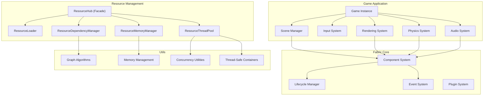
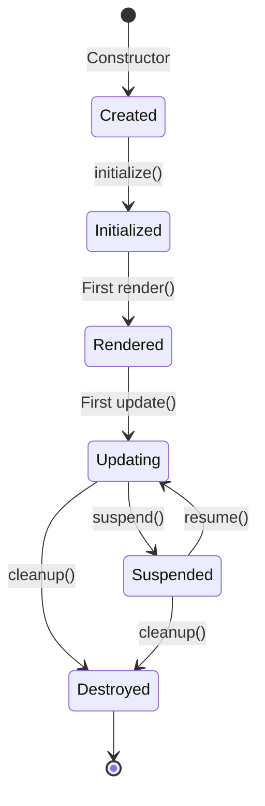
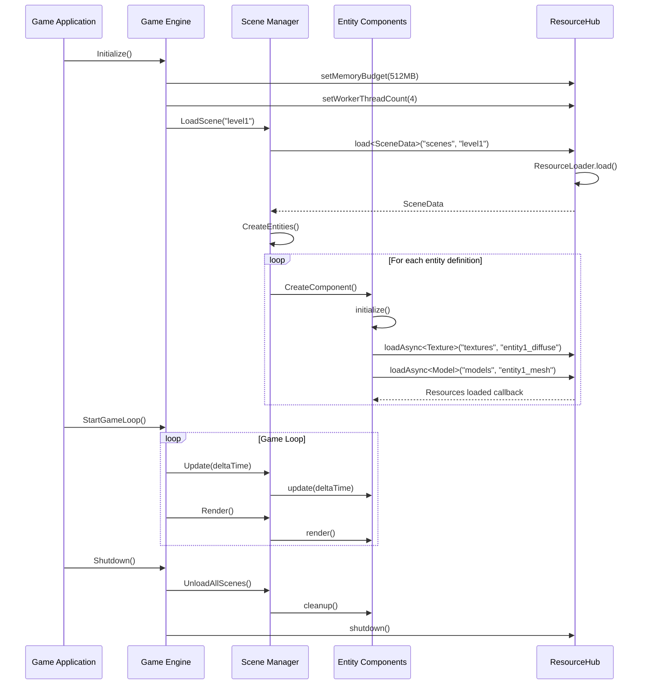
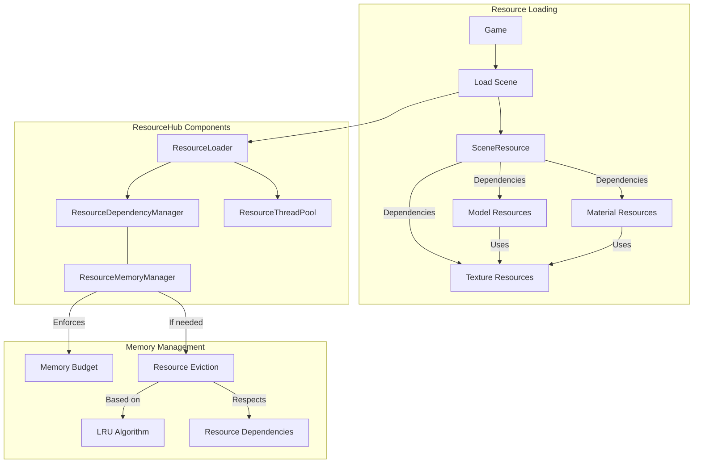
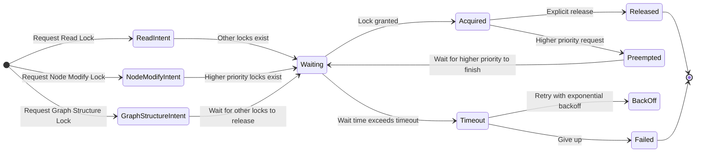
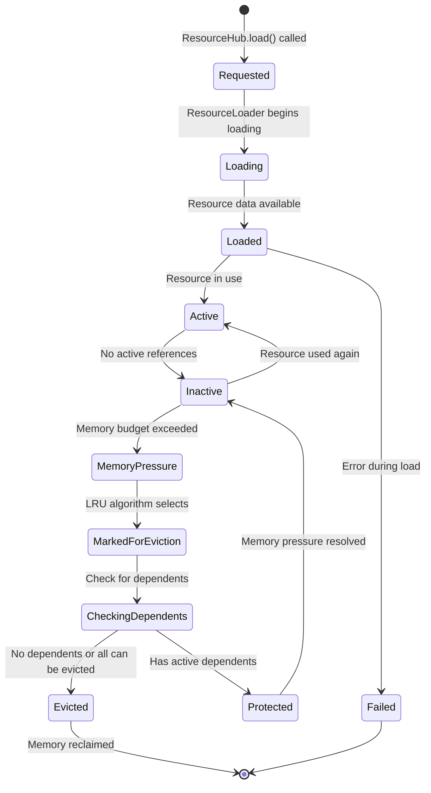
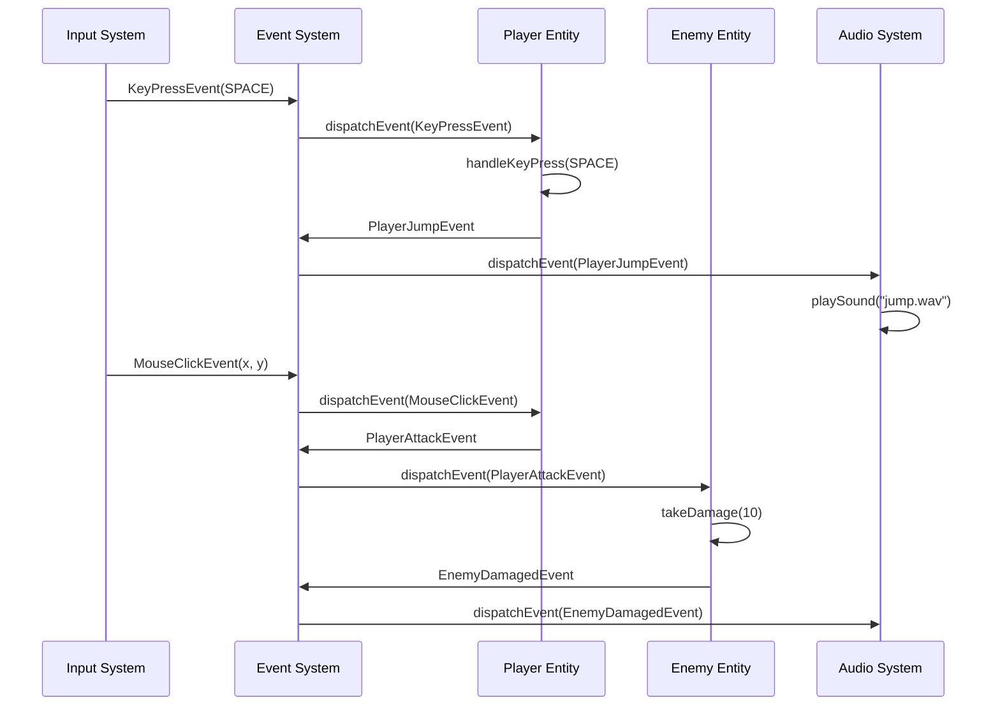

# Fabric Engine Component Flow

This document illustrates how the refactored Fabric components interact to create a robust game engine architecture. These diagrams provide a clear visual representation of the system design.

## System Architecture

The overall system architecture divides functionality into distinct layers:

## Component Lifecycle

Components follow a consistent, predictable lifecycle:

## Game Execution Flow

This sequence illustrates a typical game execution flow:

## Resource Management

The resource system handles dependencies and memory management:

## Concurrency Model

Our concurrency system uses intent-based locking with timeouts:

## Resource Lifecycle

Resources follow a predictable lifecycle with memory management:

## Event System Flow

The event system provides loose coupling between components:

