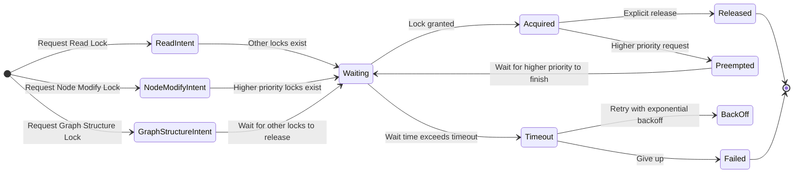

# Quantum Fluctuation Concurrency Model

## Overview

The Quantum Fluctuation concurrency model is a core innovation in Fabric, providing a sophisticated approach to thread coordination with intent-based locking. This model enables highly concurrent operations while preventing deadlocks and race conditions.

## Core Principles

The model is built around five key principles:

1. **Intent Declaration**: Explicitly stating the purpose and scope of lock acquisition
2. **Awareness Propagation**: Higher-priority operations communicate with existing lock holders
3. **Lock Coordination**: Locks interact intelligently based on priority and intent
4. **Timeout Protection**: All lock operations have timeouts to prevent indefinite waits
5. **Lock Hierarchies**: Consistent lock ordering prevents deadlocks

## Intent-Based Locking

Unlike traditional read/write locks, Quantum Fluctuation introduces a hierarchy of lock intents:

- **Read**: For read-only operations (lowest priority)
- **NodeModify**: For modifying node data without changing structure
- **GraphStructure**: For structural changes to the graph (highest priority)

This approach provides several advantages:
- Higher-priority operations can signal their intent to lower-priority lock holders
- Operations can adjust behavior based on the system's current locking state
- Lock acquisition follows a consistent priority order to prevent deadlocks

## Fluctuation States

A lock in the Quantum Fluctuation model can exist in multiple states:



## Implementation in CoordinatedGraph

The model is primarily implemented in the `CoordinatedGraph` class:

```cpp
template <typename T>
class CoordinatedGraph {
public:
    enum class LockIntent { Read, NodeModify, GraphStructure };
    
    class LockGuard {
    public:
        bool isLocked() const;
        void release();
        T* getNode();
        
    private:
        std::variant<std::shared_lock<std::shared_mutex>, 
                   std::unique_lock<std::shared_mutex>> lock_;
        bool locked_ = false;
    };
    
    // Attempt to lock with timeout and intent
    Result<LockGuard> tryLock(
        const std::string& nodeId, 
        LockIntent intent,
        std::chrono::milliseconds timeout = std::chrono::milliseconds(100));
        
    // Graph-level operations
    Result<void> addNode(const std::string& key, const T& data);
    Result<void> removeNode(const std::string& key);
    Result<void> addEdge(const std::string& from, const std::string& to);
    Result<void> removeEdge(const std::string& from, const std::string& to);
    
    // Traversal with proper locking
    Result<std::vector<std::string>> topologicalSort();
};
```

## Timeout Protection

All lock acquisitions use timeout protection to prevent indefinite waiting:

```cpp
// Example of timeout-protected locking
auto nodeLock = graph.tryLock(nodeId, LockIntent::Read, 100ms);
if (!nodeLock.isSuccess()) {
  // Handle lock acquisition failure - log and return gracefully
  return Result<void>::failure(Error(Error::Code::OperationTimedOut,
                               "Timed out waiting for node lock"));
}

// Use the lock and release it automatically via RAII
auto node = nodeLock.value().getNode();
```

## Copy-Then-Process Pattern

A key pattern in the Quantum Fluctuation model is to minimize lock duration by copying data first:

```cpp
// Get IDs of all resources
std::vector<std::string> resourceIds;
{
  auto graphLock = resourceGraph_.tryLock(LockIntent::Read, 100ms);
  if (!graphLock.isSuccess()) {
    return Result<void>::failure(Error(Error::Code::OperationTimedOut,
                                "Timed out waiting for graph lock"));
  }
  
  resourceIds = resourceGraph_.getAllNodeIds();
}

// Process resources without holding the graph lock
for (const auto& id : resourceIds) {
  processResource(id);
}
```

## ResourceHub Integration

The `ResourceHub` uses Quantum Fluctuation to provide thread-safe resource management:

```cpp
class ResourceHub {
public:
  // Thread-safe operations on resources
  template <typename T>
  ResourceHandle<T> load(const std::string &typeId, const std::string &resourceId);
  
  template <typename T>
  void loadAsync(const std::string &typeId, const std::string &resourceId,
                ResourcePriority priority,
                std::function<void(ResourceHandle<T>)> callback);
                
  bool addDependency(const std::string &dependentId, const std::string &dependencyId);
  bool removeDependency(const std::string &dependentId, const std::string &dependencyId);
  
private:
  // Uses CoordinatedGraph for thread-safe dependency tracking
  CoordinatedGraph<std::shared_ptr<Resource>> resourceGraph_;
};
```

## Best Practices

To effectively use the Quantum Fluctuation model:

1. **Always declare your intent**: Use the appropriate lock intent
2. **Minimize lock scope**: Hold locks for the shortest possible time
3. **Follow lock hierarchies**: Acquire locks in a consistent order
4. **Use timeout protection**: Always specify reasonable timeouts
5. **Handle lock failures**: Check if locks were acquired successfully
6. **Use the Copy-Then-Process pattern**: Make local copies to minimize lock duration

## Advantages Over Traditional Models

The Quantum Fluctuation model offers several advantages:

1. **Deadlock Prevention**: Timeout protection and consistent ordering
2. **Maximum Concurrency**: Intent-based locking allows more parallelism
3. **Adaptive Behavior**: Operations can adjust based on system state
4. **Graceful Degradation**: Operations fail or retry rather than deadlock
5. **Self-Regulation**: The system balances competing priorities automatically